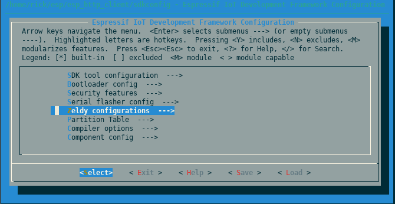
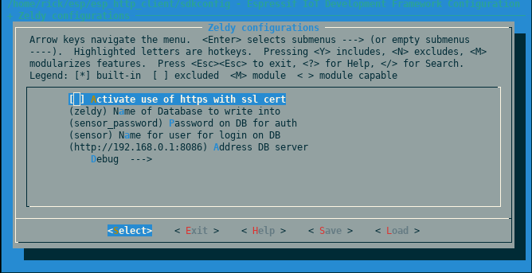

# Zeldy_MCU

Group project SERI Supelec 2018 : Tangy Renaud, Simon Brelivet, Julia Desmazes

This is the main repository from the MCU's code. This code handles the
aquisition/handeling of the data from the circuit ( see Zeldy_HW ) and
sends it via HTTPS to a influxDB database on our server ( see Zeldy_Server ).

This code uses the [`esp-idf` framework](https://docs.espressif.com/projects/esp-idf/en/latest/index.html)
with [`freeRTOS`](https://www.freertos.org/).

## Build

Once you have the esp-idf toolchain installed you can easily configure
your project using `make menuconfig`.

Enter the `Zeldy configuration` menu to set your own configurations.

> ** HTTPS** Your ssl key should be in a file named `ssl_com_root_cert.pem` and should be placed in folder `main`.

To build for your esp use `make build` and to upload to your device `make flash`.

## Trouble shooting

Log information is available via serial and you can acces it by launching
the serial monitor with `make monitor`. If you need additional debug information
you can acctivate the `DEBUG` flag in the `make menuconfig` sub/menu
`Zeldy Configuration/Debug`. In the same debug menu you can also toggle the
`PROD` flag to enable default debug values and checks for your data.

## License

This code is released under the GNU v3 public license.

## Release notes

- Influx DB is expecting IEEE-754 floats (aka float 64).
- HTTP errors 500 `invalid UTF-8 string` have occured on InfluxDB since version 1.6.5 so please use with prior versions.

## Resources

- [MBEDTLS error documentation](https://tls.mbed.org/api/group__x509__module.html#gaeb90af9ad906c5075b1ad625ebc26553)
    Common errors are :
    - `-0x2700` MBEDTLS_ERR_X509_CERT_VERIFY_FAILED, Certificate verification of the server failed, e.g. CRL, CA or signature check failed.

